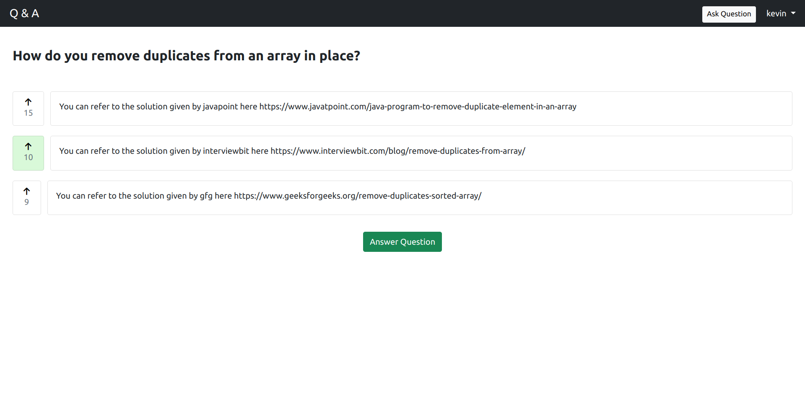

# Question Answer

This is a project made by [Kevin Joshi](https://github.com/KevinJ-hub) & [Kaushal Binjola](https://github.com/KaushalBinjola).  
Database used is PostgreSQL as well and various dependencies like [Django Crispy Forms](https://django-crispy-forms.readthedocs.io/en/latest/) & [Django Rest Framework](https://www.django-rest-framework.org/) have been used.  
It is a web app where users can ask and answer questions as well as up vote the answers. This is just one functional module of the whole web app where the business model is running ads and the revenue generated is then used to pay the users who have answered the questions based on the activity on the question as well as the relative up votes received for the answer.

## Tech Used

- Python
- Django
- PostgreSQL
- Javascript
- Bootstrap5
- Font Awesome

## Running this project

1. Clone the repository
2. Create the env file using the env-sample file
3. Run the following command from the root of the project

```bash
pip install -r requirements.txt
```

```bash
py manage.py makemigrations
```

```bash
py manage.py migrate
```

4. Create a super user to access django admin panel (optional)

```bash
py manage.py createsuperuser
```

5. Run the server

```bash
py manage.py runserver
```

> **NOTE:** You can also create a virtual environment, activate it and follow the above steps.

## Images

### Desktop


---


---


---


---


---


### Mobile Devices

|  |  |  |
|---|---|---|
|  |  |  |  
